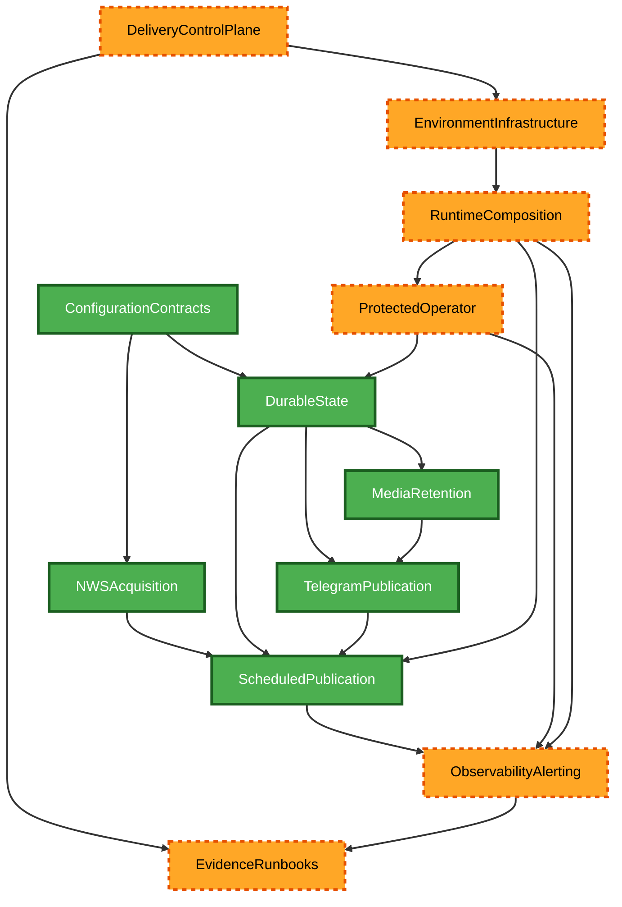

# Component Dependencies and Communication

## Dependency Direction

Dependencies point inward toward validated domain contracts. Runtime composition binds outward
adapters; infrastructure and delivery controls remain outside the publication runtime and exchange
only immutable references and safe evidence with their AWS control-plane interfaces.

Text alternative: configuration supports NWS acquisition and durable state. State, NWS acquisition,
media retention, and Telegram publication support the scheduled-publication service. Runtime
composition constructs runtime services; protected operations and observability use durable state
and safe events. Infrastructure supplies runtime boundaries, while the delivery control plane plans
and governs infrastructure and writes safe evidence/runbook references.

## Dependency Matrix

| Consumer                   | Dependency                             | Communication                                | Constraint                                                         |
| -------------------------- | -------------------------------------- | -------------------------------------------- | ------------------------------------------------------------------ |
| NWS Acquisition            | Configuration Contracts                | Typed registry/configuration values          | One configured active office; safe HTTPS source bounds.            |
| Scheduled Publication      | NWS, Durable State, Media, Publication | Narrow injected protocols and typed results  | One office/run; deadline and revision caps.                        |
| Media Retention            | Durable State                          | Typed image metadata and commit port         | Commit only verified current media.                                |
| Telegram Publication       | Durable State and Media                | Reservation, validated metadata, safe result | One effect per started reservation; no automatic ambiguous resend. |
| Protected Operator         | Durable State and Observability        | Validated command and safe result            | Caller/environment/object/state checks deny by default.            |
| Runtime Composition        | All runtime services                   | Constructor injection                        | Only assembly layer resolves AWS configuration/secrets.            |
| Environment Infrastructure | Runtime Composition                    | Parameters, IAM grants, resource references  | Isolated environment resources and least privilege.                |
| Delivery Control Plane     | Environment Infrastructure             | Exact artifact/evidence/plan references      | No mutation before passing gates and authorization.                |
| Evidence and Runbooks      | Delivery/Observability                 | Allowlisted immutable references             | No secrets, raw bodies, or private identifiers.                    |

## Data Flows

1. Scheduler event → Lambda boundary → runtime composition → Scheduled Publication Service →
   NWS/State/Media/Telegram ports → bounded run result → observability.
2. Authorized operator event → Lambda boundary → runtime composition → Protected Operator Service
   → Durable State → safe reconciliation/office-information result → observability.
3. Read-only GitHub artifact → Revision Verification → Infracost and Change-Set Planning →
   immutable classification/evidence → owner approval for every staging change → exact
   CloudFormation execution → safe release/recovery evidence.
4. Classified internal event → CloudWatch alarm state transition → alert-notification Lambda →
   dedicated private Telegram alert → definitive-failure-only SNS/email fallback.

No data flow permits runtime publication services to approve, plan, or mutate infrastructure; no
delivery flow provides raw secrets or private Telegram destinations to repository evidence. No alert
flow persists custom fingerprint, cooldown, aggregation, or delivery state in DynamoDB.
