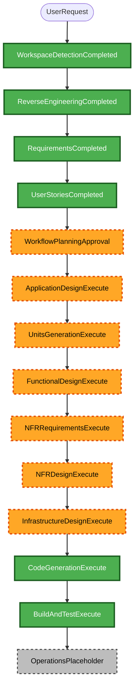

# Execution Plan

## Detailed Analysis Summary

### Transformation Scope

- **Transformation type**: Architectural and infrastructure transformation of an existing
  single-package Lambda service.
- **Primary changes**: Complete the remaining application behavior; introduce AWS SAM,
  CloudFormation, delivery roles, CodePipeline/CodeBuild, Infracost evidence and policy gates;
  harden observability, recovery, and contributor workflows.
- **Related components**: Python domain services and handlers; environment/configuration schemas;
  unit and integration tests; SAM templates and deployment policies; GitHub validation workflows;
  deployment evidence and runbooks.

### Change Impact Assessment

| Area          | Impact | Summary                                                                                                                                        |
| ------------- | ------ | ---------------------------------------------------------------------------------------------------------------------------------------------- |
| User-facing   | Yes    | Subscribers receive bounded, non-duplicative Weather Story updates and safe captions.                                                          |
| Structural    | Yes    | The Lambda code gains production adapters and is deployed through SAM-defined resources and a cloud delivery control plane.                    |
| Data model    | Yes    | Durable projections, append-only events, attempt states, TTL, backup, and recovery contracts must be completed.                                |
| API/contracts | Yes    | NWS and Telegram boundary validation, Lambda event contracts, protected reconciliation, and deployment evidence contracts change or are added. |
| NFR           | Yes    | Performance, delivery semantics, security, privacy, observability, cost control, reproducibility, and property testing are all in scope.       |

### Component Relationships

| Component                                                                   | Change type | Reason and priority                                                                                           |
| --------------------------------------------------------------------------- | ----------- | ------------------------------------------------------------------------------------------------------------- |
| `weather_story_bot.config`, models, and protocols                           | Major       | Foundational validated configuration and domain contracts; must update first.                                 |
| NWS ingestion, history, image, Telegram, scheduled-processing, and handlers | Major       | Complete the publication state machine and protected runtime behavior; depends on the foundational contracts. |
| `config/` and `data/`                                                       | Minor       | Supply environment isolation, office activation, and non-secret schema inputs.                                |
| `tests/`                                                                    | Major       | Add focused examples and meaningful Hypothesis properties alongside adapter and policy tests.                 |
| SAM/CloudFormation and IAM                                                  | Major       | Introduce isolated resource, role, encryption, recovery, and schedule definitions.                            |
| CodePipeline, CodeBuild, Infracost, and GitHub workflows                    | Major       | Enforce exact-revision evidence and safe dev/staging versus human-gated deployment paths.                     |
| Runbooks and AI-DLC evidence                                                | Major       | Preserve operational, recovery, approval, and AI-DLC artifact traceability.                                   |

### Risk Assessment

- **Risk level**: Critical.
- **Rollback complexity**: Difficult. Stateful AWS resources require retain/recovery controls, and
  accepted Telegram effects cannot be reversed.
- **Testing complexity**: Complex. Verification requires deterministic local examples and property
  tests, mocked integrations, template/policy checks, and gated cloud planning evidence.
- **Primary mitigations**: Fail-closed validation; exact-revision artifacts and immutable change
  sets; isolated environments; no live Telegram effects in dev; human gates for sensitive changes
  and all production execution; retained recovery evidence.

## Module Update Strategy

- **Update approach**: Hybrid. Foundation and dependency-chain work is sequential; independent
  focused tests, documentation, and some policy/template work may run in parallel only after their
  contracts are stable.
- **Critical path**: Configuration and models → pure domain/state behavior → production adapters
  and handlers → SAM resource/role definitions → build, Infracost, and pipeline evidence → gated
  environment validation.
- **Coordination points**: Validated key families and state transitions; environment-scoped names,
  identifiers, secrets, and destinations; Lambda event schemas; template parameters; artifact,
  cost, change-set, approval, and release-evidence digests.
- **Testing checkpoints**: Per-unit example and property tests; repository `make check`; static SAM
  and policy checks; packaged-Pillow verification; exact-revision plan/evidence validation;
  approved isolated dev/staging checks; separately authorized production execution only.

## Workflow Visualization

Text alternative: completed discovery, requirements, and user-story stages lead to this plan's
approval. The approved plan then proceeds through application design, units generation, per-unit
functional and NFR design, infrastructure design, code generation, and final build/test. Operations
is a future placeholder.

## Phases to Execute

### INCEPTION

- [x] Workspace Detection (completed)
- [x] Reverse Engineering (completed)
- [x] Requirements Analysis (completed)
- [x] User Stories (completed)
- [x] Workflow Planning (approved)
- [ ] Application Design — **EXECUTE**
  - Rationale: multiple new adapters, handlers, services, role boundaries, and interaction
    contracts need a cohesive component design.
- [ ] Units Generation — **EXECUTE**
  - Rationale: approved stories span application, infrastructure, delivery, security, recovery,
    and documentation and must become dependency-ordered work units.

### CONSTRUCTION

- [ ] Functional Design — **EXECUTE**
  - Rationale: domain transformation, publication state, conditional persistence, reconciliation,
    and security boundaries require per-unit behavior and property analysis.
- [ ] NFR Requirements — **EXECUTE**
  - Rationale: performance, reliability, observability, cost, security, reproducibility, and the
    selected Hypothesis framework require explicit per-unit applicability and acceptance evidence.
- [ ] NFR Design — **EXECUTE**
  - Rationale: selected NFRs must be expressed as concrete logging, retry, isolation, encryption,
    access-control, evidence, retention, and testing design patterns.
- [ ] Infrastructure Design — **EXECUTE**
  - Rationale: SAM resources, IAM role separation, CloudFormation change sets, CodePipeline,
    CodeBuild, Infracost, recovery, and environment controls have material implementation detail.
- [ ] Code Generation — **EXECUTE**
  - Rationale: implementation planning and generation are mandatory after each approved unit.
- [ ] Build and Test — **EXECUTE**
  - Rationale: repository, packaging, test, security, template, policy, and evidence gates must
    prove the completed work.

### OPERATIONS

- [ ] Operations — **PLACEHOLDER**
  - Rationale: deployment and operational controls are designed and implemented in this scope, but
    the workflow's standalone Operations phase is not yet defined.

## Package Change Sequence

1. Establish and test validated configuration, domain models, state contracts, and safe utility
   boundaries.
2. Complete ingestion, persistence, image, Telegram, scheduling, reconciliation, alerting, and
   runtime/handler behavior with deterministic adapter tests and applicable properties.
3. Add environment configuration and SAM infrastructure with least-privilege IAM, encrypted
   retained storage, schedule, monitoring, backup, and recovery controls.
4. Add exact-revision CodeConnections, CodeBuild, Infracost, CodePipeline, supply-chain, and
   CloudFormation change-set/approval controls.
5. Complete runbooks, contributor controls, evidence retention, and traceability checks.
6. Execute `make format` and `make check`, then all applicable template, package, policy, and
   gated environment validation. Remote GitHub or AWS mutation remains separately authorized.

## Success Criteria

- All approved requirements and child stories are assigned, implemented, tested, and traced without
  weakening the approved scope.
- All FR-01 through FR-14 and NFR-01 through NFR-08 have implementation and verification evidence.
- Dev remains mock-only, staging uses isolated destinations, and production changes require the
  approved human cloud-native gate and separate authorization for any remote action.
- `make check` passes after code changes, and added properties complement focused example tests.
- Security Baseline and Property-Based Testing controls are enforced at their applicable stages;
  Resiliency Baseline remains disabled.

## Planning Horizon

- **Total planned stages**: Eight executable stages after Workflow Planning: Application Design,
  Units Generation, Functional Design, NFR Requirements, NFR Design, Infrastructure Design, Code
  Generation, and Build and Test.
- **Execution cadence**: Complete and approve each AI-DLC stage or unit in dependency order; no
  calendar-duration estimate is asserted because the approved scope requires evidence-driven,
  human-gated cloud planning and each remote action needs separate authorization.

## Extension Compliance

| Extension rules                 | Status                   | Rationale                                                                                                                                                                                                                                                                                                                                              |
| ------------------------------- | ------------------------ | ------------------------------------------------------------------------------------------------------------------------------------------------------------------------------------------------------------------------------------------------------------------------------------------------------------------------------------------------------ |
| SECURITY-01 through SECURITY-15 | Compliant                | The plan assigns every applicable storage, logging, validation, IAM, access-control, hardening, supply-chain, integrity, monitoring, and fail-safe control to later design/build work. SECURITY-02, SECURITY-04, and SECURITY-07 remain N/A because the approved architecture has no network intermediary, HTML endpoint, or customer-managed network. |
| PBT-01 through PBT-10           | N/A at Workflow Planning | The PBT stage matrix begins enforcement at Functional Design, NFR Requirements, Code Generation, and Build and Test. This plan explicitly schedules those stages and preserves focused-example and Hypothesis obligations.                                                                                                                             |
| Resiliency Baseline             | N/A                      | Disabled in the approved extension configuration.                                                                                                                                                                                                                                                                                                      |

No blocking extension finding remains.
