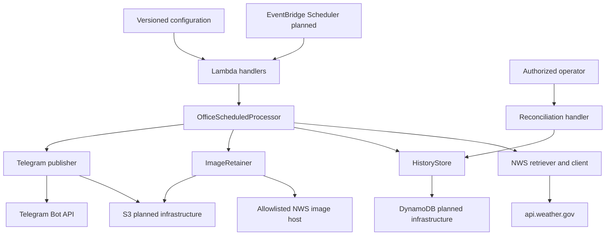
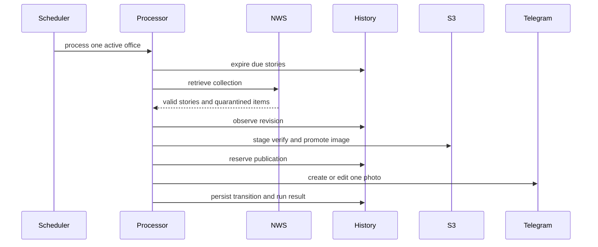
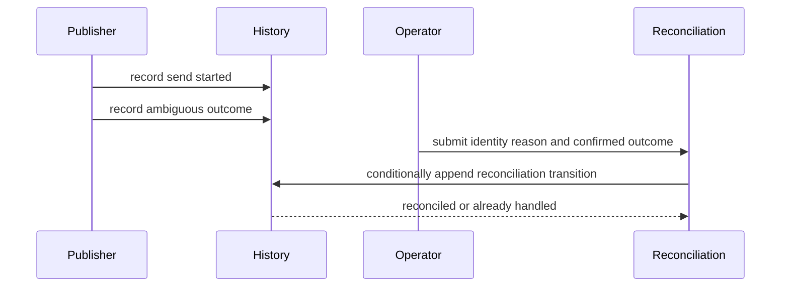

# System Architecture

## System Overview

Weather Story Bot is a single Python package intended for AWS Lambda. Its implemented core uses
dependency-injected protocols around HTTP, DynamoDB, S3, and Telegram so business behavior can be
tested without network access. The repository does not yet contain its planned AWS SAM template or
deployable publisher composition; those remain in the OpenSpec task set.

## Architecture Diagram

Text alternative: a planned EventBridge schedule invokes a Lambda handler for one office. The
processor retrieves NWS data, persists state through `HistoryStore`, retains verified images in S3,
and publishes through Telegram. A separate protected handler reconciles ambiguous publications.
Versioned configuration supplies non-secret runtime settings.

## Component Descriptions

### `weather_story_bot.config`

- **Purpose**: Domain and environment configuration validation.
- **Responsibilities**: Validate office seeds, enriched registry records, environment isolation,
  canonical NWS URLs, timezones, destinations, and the Telegram secret shape.
- **Dependencies**: Pydantic, timezonefinder, Python zoneinfo.
- **Type**: Application model and configuration component.

### `weather_story_bot.nws_client`

- **Purpose**: Bounded NWS collection HTTP transport.
- **Responsibilities**: Apply identifying headers and deadlines; classify `4xx`, `429`, `5xx`,
  connection, and timeout outcomes; make at most one in-budget retry.
- **Dependencies**: httpx.
- **Type**: External service client.

### `weather_story_bot.ingestion`

- **Purpose**: Office enrichment and Weather Story normalization.
- **Responsibilities**: Validate flat JSON-LD models, guard regional URLs, seed the office registry,
  validate collection completeness, and quarantine invalid siblings.
- **Dependencies**: config, nws_client, Pydantic, httpx, injected geocoder.
- **Type**: Application service and domain model component.

### `weather_story_bot.history`

- **Purpose**: DynamoDB persistence and publication state machine.
- **Responsibilities**: Maintain current office/story projections, image state, run and quarantine
  records, publication reservations/transitions, reconciliation, TTL-aware reads, and bounded safe
  metadata.
- **Dependencies**: boto3 DynamoDB conditions, config and ingestion models.
- **Type**: Persistence component.

### `weather_story_bot.image_retention`

- **Purpose**: Secure two-phase image retention.
- **Responsibilities**: Download and validate images, stage and verify S3 objects, promote current
  objects, conditionally commit references, delete replacements, and reconcile staging orphans.
- **Dependencies**: httpx, Pillow, botocore, history image metadata.
- **Type**: Media storage service.

### `weather_story_bot.telegram`

- **Purpose**: Safe Telegram photo creation and editing.
- **Responsibilities**: Render UTF-16-aware captions, validate retained images before calls,
  classify responses, transition attempt state, and retry definitive failures with new reservations.
- **Dependencies**: Pillow, regex, history and image-retention contracts.
- **Type**: External service adapter and publishing service.

### `weather_story_bot.scheduled_processing`

- **Purpose**: Pure orchestration of one active office run.
- **Responsibilities**: Expire current state, retrieve and order stories, enforce caps/deadlines,
  retain and publish revisions, persist deferrals, and finalize run outcomes.
- **Dependencies**: Narrow protocols implemented by ingestion, history, image, and Telegram layers.
- **Type**: Application orchestration component.

### `weather_story_bot.runtime`

- **Purpose**: Validate packaged runtime configuration and AWS resource references.
- **Responsibilities**: Load registry/environment files and ensure active office/channel agreement.
- **Dependencies**: config.
- **Type**: Runtime composition support; full composition remains planned.

### `weather_story_bot.handler`

- **Purpose**: AWS Lambda entry points.
- **Responsibilities**: Validate scheduled input, invoke a configured publisher runtime, and perform
  protected ambiguous-outcome reconciliation through DynamoDB.
- **Dependencies**: boto3 and history.
- **Type**: Delivery adapter.

## Primary Publishing Interaction

Text alternative: each invocation expires due state, retrieves one collection, independently
validates items, observes revisions, retains changed images, reserves publication, makes one
Telegram create/edit call per reservation, and persists transitions plus the run result.

## Ambiguous Publication Interaction

Text alternative: an uncertain send is durably marked ambiguous and never automatically resent.
An authorized operator records `confirmed_received` or `confirmed_not_received`; only the latter
allows a later poll to reserve another attempt.

## Integration Points

- **External APIs**: NWS office, regional-office, Weather Story collection, and image endpoints;
  Telegram Bot API; an injected geocoding service during registry enrichment.
- **Databases**: DynamoDB current and operational records through a single-table key design.
- **Object Storage**: Private S3 staging and current-image namespaces.
- **AWS Control Plane**: EventBridge Scheduler, Lambda, Secrets Manager, SNS, CloudWatch, IAM,
  AWS Backup, Budgets, and CloudFormation are planned but not yet defined in a SAM template.
- **GitHub**: Pull-request validation, CodeQL, dependency review, Dependabot, and repository policy
  are present; OIDC deployment, Infracost, release, and extended evidence workflows are planned.

## Infrastructure Components

- **CDK Stacks**: None.
- **Terraform**: None; explicitly excluded by OpenSpec.
- **SAM/CloudFormation**: Required by OpenSpec but not yet implemented.
- **Deployment Model**: Planned isolated `dev`, `staging`, and `prod` stacks in `us-east-2`, with
  distinct destinations and disabled schedules until smoke gates pass.
- **Networking**: No VPC design is currently present; the service is designed to call public HTTPS
  APIs and AWS managed services.
