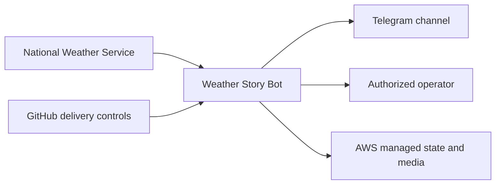

# Business Overview

## Business Context Diagram

Text alternative: the service retrieves public Weather Stories from the National Weather
Service, validates and retains them in AWS, publishes approved changes to Telegram, exposes
protected reconciliation to an operator, and is governed through GitHub delivery controls.

## Business Description

- **Business Description**: Weather Story Bot makes visual National Weather Service Weather
  Stories available as timely, mobile-friendly Telegram photo messages. It is explicitly not an
  emergency-alerting service.
- **Current MVP Scope**: Only the Milwaukee/Sullivan office, `MKX`, is active. The registry is
  designed to contain every NWS Weather Forecast Office for later activation.
- **Business Objective**: Publish each eligible new or materially changed story without creating
  avoidable duplicates, retain the current image and story facts, and provide a durable operational
  record for review and lightweight analytics.

## Business Transactions

1. **Seed and validate the office registry**: Enrich versioned office IDs with NWS metadata,
   geocoded coordinates, derived timezones, and environment-specific destinations.
2. **Poll one active office**: Accept exactly one office ID per scheduled invocation, expire due
   current stories, and retrieve that office's Weather Story collection.
3. **Normalize a collection**: Validate the collection envelope, independently validate each item,
   quarantine malformed siblings, and derive an office-scoped UUID identity for valid items.
4. **Detect a material revision**: Hash normalized story fields plus the downloaded image digest;
   update only the current projection while preserving first-seen and publication facts.
5. **Retain the current image**: Validate an allowlisted HTTPS JPEG or PNG, stage it in S3, verify
   stored metadata, promote it to a deterministic current key, and conditionally commit the
   reference in DynamoDB.
6. **Publish or edit a Telegram photo**: Reserve one create or edit attempt, make at most one
   Telegram call for that reservation, and persist the acknowledged, rejected, or ambiguous result.
7. **Reconcile an ambiguous publication**: Allow an authorized operator to record whether an
   uncertain send was received, enabling a later retry only when confirmed not received.
8. **Record an office run**: Persist bounded outcome counts, failure reasons, controlled deferrals,
   elapsed time, and the terminal run status.
9. **Review current and operational history**: Query office/story projections and unexpired run,
   quarantine, attempt, and transition records without table scans.

## Business Dictionary

- **Active office**: An office enabled for processing with a configured Telegram destination.
- **Canonical story identity**: The pair `(office_id, source_story_id)`, where `source_story_id` is
  the UUID in a validated download URL.
- **Current story**: The retained latest accepted projection for one canonical identity; it is not a
  source-revision archive.
- **Material revision**: A change in normalized story fields or retained image digest.
- **Publication reservation**: A leased, single-use authorization for one Telegram create or edit
  call.
- **Ambiguous outcome**: A send whose acceptance cannot be established and must not be retried
  automatically.
- **Controlled deferral**: Eligible work intentionally left for a later poll because of the 25-story
  cap or run-time budget.
- **Quarantine**: Bounded validation metadata for one malformed collection item; raw input is not
  retained.
- **Current image**: The verified image object referenced by current story state and retained after
  story expiration.

## Component-Level Business Descriptions

### Configuration and Office Registry

- **Purpose**: Establish safe, reviewable environment and office inputs.
- **Responsibilities**: Validate MKX-only activation, environment isolation, canonical endpoints,
  timezones, mock-only development behavior, and the secret document shape.

### NWS Ingestion

- **Purpose**: Convert public NWS office and Weather Story responses into trusted domain objects.
- **Responsibilities**: Enrich offices, enforce source contracts, classify bounded failures, retry
  within budget, and quarantine malformed story items.

### Durable History

- **Purpose**: Prevent duplicate work and retain current business facts plus short-lived audit data.
- **Responsibilities**: Maintain current office/story records, reservations, transitions, run
  results, deferrals, quarantines, and alert fingerprints using conditional DynamoDB operations.

### Image Retention

- **Purpose**: Ensure only safe and verified source images can be published.
- **Responsibilities**: Enforce URL, redirect, byte, type, decode, dimension, checksum, staging,
  promotion, cleanup, and replacement rules.

### Telegram Publishing

- **Purpose**: Publish one photo message per current story and edit it for later revisions.
- **Responsibilities**: Render bounded captions, revalidate retained media, classify delivery
  outcomes, preserve one-call-per-reservation semantics, and retry only definitive failures through
  new reservations.

### Scheduled Processing

- **Purpose**: Coordinate one bounded, office-scoped publishing run.
- **Responsibilities**: Order priority stories, enforce the processing budget and revision cap,
  persist deferrals and failures, and produce an objective terminal result.

### Delivery and Operations Controls

- **Purpose**: Keep source changes and eventual AWS deployments reviewable and safe.
- **Responsibilities**: Run locked validation and security checks now; OpenSpec plans SAM,
  observability, Infracost, OIDC deployment, release evidence, and recovery controls.
