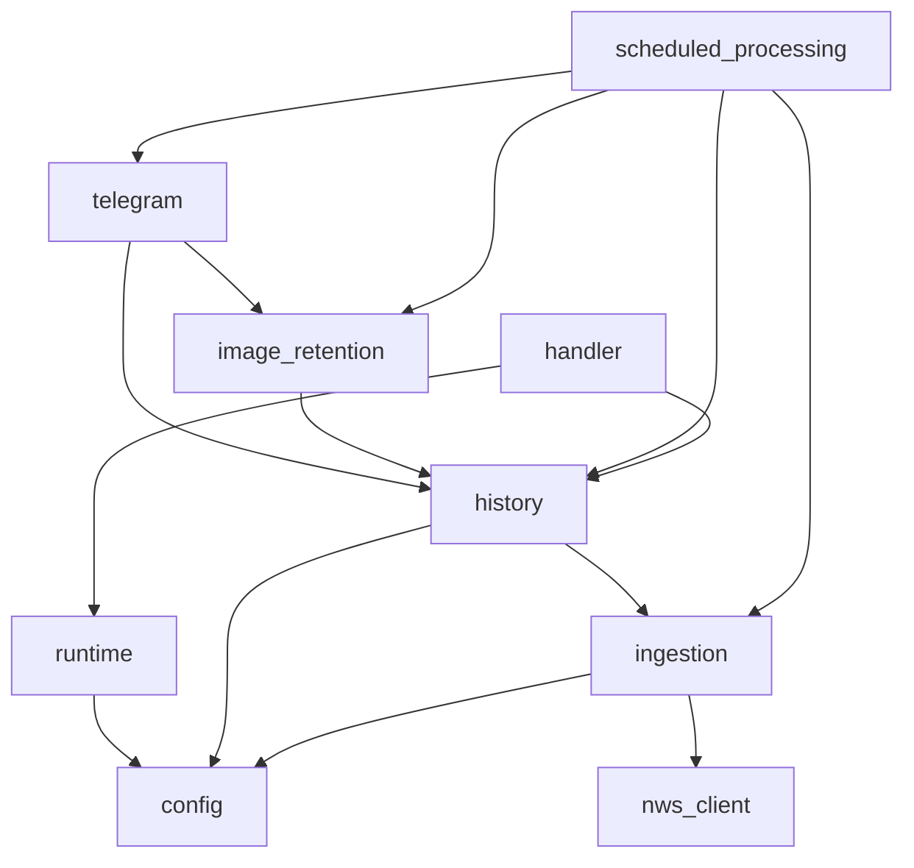

# Code Structure

## Build System

- **Package Manager**: uv 0.12.3 with committed `uv.lock`.
- **Build Backend**: Hatchling.
- **Runtime**: Python 3.13.7, constrained to Python 3.13.
- **Task Runner**: Make targets for formatting, linting, strict type checking, testing, coverage,
  and locked dependency synchronization.
- **Source Layout**: One installable package under `src/weather_story_bot`.
- **Test Layout**: Unit, integration-style component, repository-policy, and property tests under
  `tests`.

## Module Hierarchy

Text alternative: `scheduled_processing` composes the ingestion, history, image, and Telegram
contracts. Configuration supports ingestion, history, and runtime loading. Telegram and image
retention consume persistence models. Handlers expose scheduled and reconciliation entry points.

## Existing Files Inventory

### Application Source

- `src/weather_story_bot/__init__.py` - Package marker.
- `src/weather_story_bot/config.py` - Versioned domain and environment configuration models.
- `src/weather_story_bot/handler.py` - Publisher and reconciliation Lambda entry points.
- `src/weather_story_bot/history.py` - DynamoDB key contracts, current state, operational records,
  publication state machine, and reconciliation.
- `src/weather_story_bot/image_retention.py` - Bounded download, image validation, S3 two-phase
  retention, and staging cleanup.
- `src/weather_story_bot/ingestion.py` - NWS source models, office enrichment, and collection
  normalization.
- `src/weather_story_bot/nws_client.py` - NWS request classification and deadline-aware retry.
- `src/weather_story_bot/runtime.py` - Packaged config and resource-reference loading.
- `src/weather_story_bot/scheduled_processing.py` - Pure office-scoped run orchestration.
- `src/weather_story_bot/telegram.py` - Caption rendering, retained-media validation, Telegram
  publication, outcome classification, and retry behavior.

### Tests

- `tests/test_config.py` - Configuration, registry, environment, timezone, and secret validation.
- `tests/test_handler.py` - Lambda input and reconciliation adapter behavior.
- `tests/test_history.py` - Single-table persistence, pagination, leases, transitions, and recovery.
- `tests/test_image_retention.py` - Image limits, redirects, staging, integrity, and cleanup.
- `tests/test_ingestion.py` - Office enrichment and item/envelope normalization contracts.
- `tests/test_nws_client.py` - Failure classification, Retry-After, and run-budget retry rules.
- `tests/test_package.py` - Importability smoke check.
- `tests/test_property_invariants.py` - Deterministic state, normalization, retry, sanitizer, hash,
  timestamp, and redirect invariants.
- `tests/test_repository_policy.py` - CI, security, redaction, and documentation policy checks.
- `tests/test_runtime.py` - Runtime configuration composition validation.
- `tests/test_scheduled_processing.py` - Ordering, deferral, failure, expiration, and digest behavior.
- `tests/test_telegram.py` - Telegram call count, media safety, response handling, captions, and
  Unicode invariants.

### Configuration and Architecture Inputs

- `pyproject.toml` and `uv.lock` - Direct and resolved dependency contracts.
- `mise.toml` and `.python-version` - Pinned toolchain inputs.
- `Makefile` - Contributor validation commands.
- `config/environments/*.json` - Versioned non-secret environment inputs.
- `config/secrets/telegram-secret.v1.schema.json` - Secret shape only.
- `data/nws_office_ids.v1.json` - Versioned 124-office seed set.
- `docs/data-model.md` - Persisted key, retention, and lifecycle contract.
- `docs/state-diagram.md` - Persistent state-transition reference.
- `docs/history-operations.md` - Review, reconciliation, purge, and recovery runbook.
- `openspec/changes/init/` - Broad service requirements and implementation task state.
- `openspec/changes/infracost-integration/` - Cost-estimation and fail-closed deployment-gate
  requirements.

## Design Patterns

### Ports and Adapters

- **Location**: Protocols throughout ingestion, history, image retention, Telegram, and scheduling.
- **Purpose**: Keep AWS, HTTP, geocoding, and Telegram effects replaceable and testable.
- **Implementation**: Narrow structural protocols are injected into pure application services.

### Current Projection plus Immutable Operational Events

- **Location**: `history.py`.
- **Purpose**: Retain current business state indefinitely while bounding operational history.
- **Implementation**: Mutable `CURRENT` records coexist with immutable attempts, transitions, runs,
  quarantines, and deferrals carrying TTLs.

### Conditional State Machine

- **Location**: Publication reservation and transition methods in `history.py`.
- **Purpose**: Protect the one-call-per-reservation and no-automatic-ambiguous-retry invariants.
- **Implementation**: DynamoDB conditional and transaction writes enforce ownership, lease, revision,
  and legal-transition constraints.

### Two-Phase Media Commit

- **Location**: `image_retention.py`.
- **Purpose**: Prevent unverified or partial images from becoming publishable.
- **Implementation**: Stage, verify, promote, verify again, conditionally commit, then clean up.

### Pure Orchestration

- **Location**: `scheduled_processing.py`.
- **Purpose**: Make run selection and classification deterministic and network-independent in tests.
- **Implementation**: All effects sit behind injected protocols and controlled clocks/ID factories.

## Critical Dependencies

- **boto3 1.43.74** - DynamoDB resource access and AWS runtime integration.
- **httpx 0.28.1** - Bounded NWS and image HTTP operations.
- **Pillow 12.3.0** - Defensive JPEG/PNG decoding and validation.
- **Pydantic 2.13.4** - Strict source, configuration, and domain validation.
- **regex 2026.7.19** - Unicode extended-grapheme segmentation for Telegram captions.
- **timezonefinder 8.3.0** - Coordinate-derived IANA timezone lookup.
- **Hypothesis 6.165.10** - Deterministic, network-independent invariant testing.
