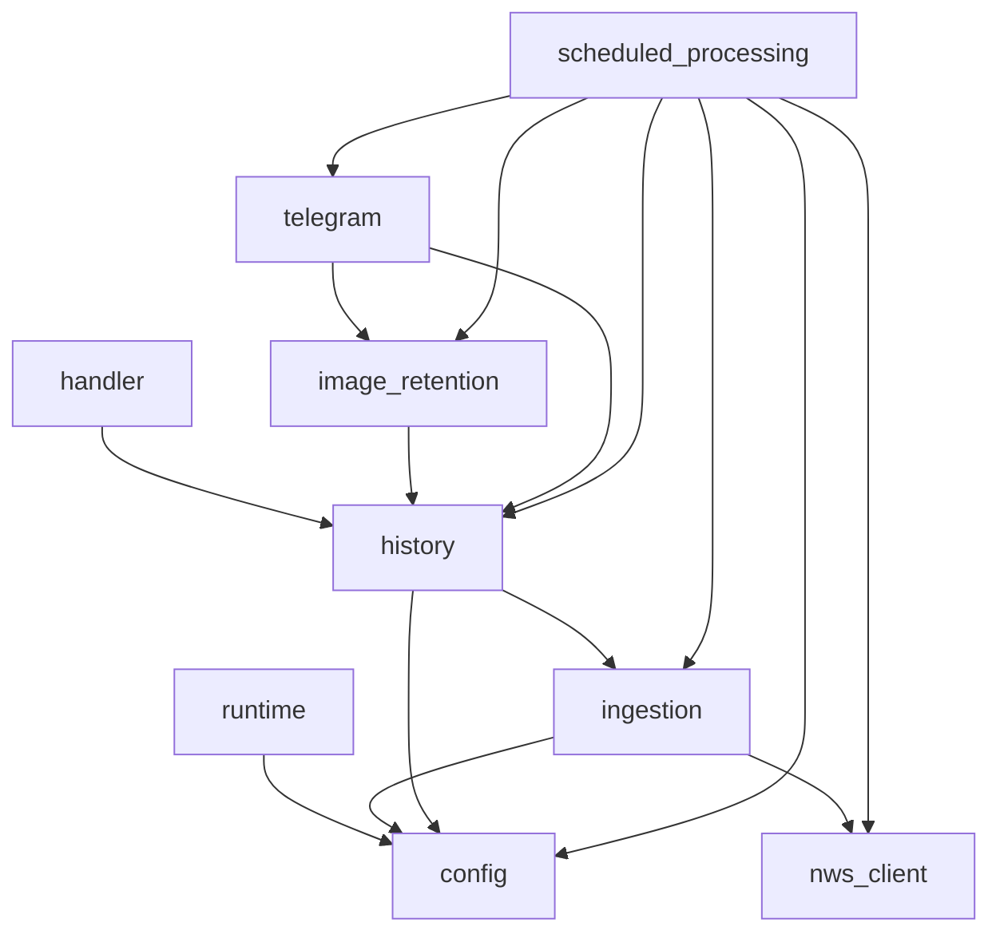

# Dependencies

## Internal Dependencies

Text alternative: configuration and NWS transport are foundational. Ingestion builds on them;
history stores ingestion models; image retention and Telegram use history contracts; scheduled
processing orchestrates all application services; handlers expose the persistence and runtime
boundaries.

### Scheduled Processing depends on Domain Services

- **Type**: Compile and runtime.
- **Reason**: It coordinates office configuration, NWS retrieval, story normalization, durable
  state, image retention, publication, and objective run completion through narrow protocols.

### History depends on Configuration and Ingestion Models

- **Type**: Compile and runtime.
- **Reason**: Office and story records are serialized from validated domain models, while
  persistence owns their mutable/immutable record contracts.

### Telegram depends on History and Image Contracts

- **Type**: Compile and runtime.
- **Reason**: Publication requires a valid reservation and committed image metadata, and terminal
  outcomes must transition durable attempt state.

### Image Retention depends on History Contracts

- **Type**: Compile and runtime.
- **Reason**: S3 promotion is publishable only after the matching current revision conditionally
  commits its verified image metadata.

### Tests depend on Every Application Module

- **Type**: Test.
- **Reason**: Tests exercise domain rules through fake HTTP, DynamoDB, S3, Telegram, clock, and ID
  adapters without network access.

## External Runtime Dependencies

### boto3 1.43.74

- **Purpose**: AWS SDK access, currently DynamoDB from the reconciliation handler and persistence
  implementation contracts.
- **License**: Apache-2.0 according to installed package metadata.

### httpx 0.28.1

- **Purpose**: NWS collection/metadata requests and streaming image downloads.
- **License**: BSD-3-Clause according to installed package metadata.

### Pillow 12.3.0

- **Purpose**: Decode and verify JPEG/PNG format, animation state, dimensions, and image integrity.
- **License**: MIT-CMU according to installed package metadata.

### Pydantic 2.13.4

- **Purpose**: Strict configuration, upstream source, and normalized story validation.
- **License**: MIT according to installed package metadata.

### regex 2026.7.19

- **Purpose**: Unicode extended-grapheme segmentation for safe Telegram truncation.
- **License**: Apache-2.0 AND CNRI-Python according to installed package metadata.

### timezonefinder 8.3.0

- **Purpose**: Derive office IANA timezones from geocoded coordinates.
- **License**: MIT according to installed package metadata.

## External Development Dependencies

- **boto3-stubs 1.43.78** - Strict DynamoDB typing support.
- **Hypothesis 6.165.10** - Property-based invariant testing; MPL-2.0.
- **mypy 2.3.1** - Strict static typing; MIT.
- **pytest 9.1.1** - Test runner; MIT.
- **pytest-cov 7.1.0** - Coverage integration; MIT.
- **Ruff 0.16.3** - Formatting and linting; MIT.
- **types-regex 2026.7.19.20260720** - Type information for regex.

## External Service Dependencies

- **National Weather Service API** - Public office metadata, regional metadata, Weather Story
  collections, and story images.
- **Geocoder implementation** - Injected during all-office registry enrichment; no concrete runtime
  adapter is present in this repository.
- **Telegram Bot API** - Photo publication/editing and planned private operational alerts.
- **AWS managed services** - DynamoDB and S3 are represented in code; the remaining services and
  resource definitions remain planned in OpenSpec.

## Dependency Management Controls

- Direct dependencies are constrained in `pyproject.toml`; the full graph is committed in
  `uv.lock`.
- Production synchronization uses `uv sync --locked --no-dev` and must not resolve a new graph.
- Dependabot proposes uv and GitHub Actions updates.
- GitHub dependency review blocks configured vulnerabilities and denied licenses on pull requests.
- OpenSpec requires later SBOM, artifact scan, and reviewed-exception evidence for releases.
