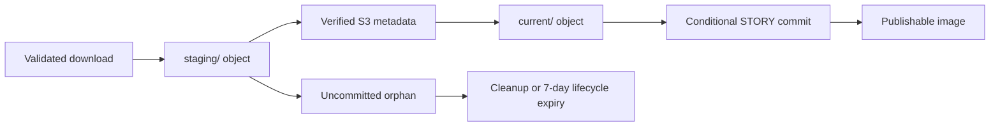

# Weather Story Bot data model

This is the living reference for persisted Weather Story Bot data. It describes the
approved target architecture from the active OpenSpec change; every entry identifies
whether it is **Implemented** in the repository or **Planned**. Keep it aligned with
the OpenSpec proposal, design, specifications, and task list.

## Privacy boundary

This document describes field names, key shapes, and contracts only. Do not add
Telegram tokens, secret values, real chat or message identifiers, invite links,
token-bearing URLs, raw request or response bodies, or raw source payloads. Durable
error and response fields are bounded and sanitizer-produced.

## DynamoDB key families

The table uses `pk` and `sk`. `office-current-index` projects
`office_current_pk` and `office_current_sk` so current stories can be queried by
office and expiration time without a table scan.

| Family | Key shape | Purpose and relationships | Mutability and retention | Safe field groups | Status |
| --- | --- | --- | --- | --- | --- |
| `OFFICE` | `OFFICE#{office_id}` / `METADATA#{recorded_at}` | NWS-enriched registry record; may hold managed pinned-office-message and invite references. | Immutable record; no TTL; retained indefinitely. | Office ID, public NWS office/region fields, coordinates/timezone, active flag, managed-reference placeholders. | Implemented (task 2.2); management workflow planned (3.6). |
| `STORY` | `STORY#{office_id}#{source_story_id}` / `CURRENT` | One current state per canonical `(office_id, source_story_id)`; links to the current image and current publication facts. | Conditionally mutable; preserves `first_seen_at` and publication facts while replacing current source/image state. No TTL; retained indefinitely, including after expiration. | Canonical identity, source timing/content fields, revision hash, lifecycle, image metadata, safe message-reference placeholder, publication status. | Implemented (2.2); end-to-end publishing planned (3.1–3.5). |
| `ATTEMPT` | `ATTEMPT#{attempt_id}` / `RECORD` | Immutable create/edit reservation audit record linked to one run, story revision, and transitions. | Immutable; `expires_at` is 30 days after creation. | Attempt/run/story IDs, revision hash, operation, reservation owner/lease, target reference placeholder. | Implemented (2.5). |
| Transition | `ATTEMPT#{attempt_id}` / `TRANSITION#{ordinal}` | Append-only event for an attempt state change; the latest ordinal derives final attempt state. | Immutable; `expires_at` is 30 days after transition. | Prior/resulting state, actor, times, lease, error class, reconciliation reason, allowlisted response metadata. | Implemented transition persistence (2.5); operator action planned (2.6). |
| `RUN` | `RUN#{run_id}` / `RESULT` | Immutable result for exactly one office invocation. | Immutable; `expires_at` is 30 days after completion. | Office/run IDs, collection outcome, status, timestamps/elapsed time, required-work flag, bounded reasons, per-office and aggregate counts. | Implemented storage contract (2.2); scheduled classification/handler planned (3.5). |
| `QUARANTINE` | `QUARANTINE#{run_id}` / `ITEM#{array_index}` | Bounded immutable fact for a malformed collection item; never creates a story identity. | Immutable; `expires_at` is 30 days after recording. | Run ID, array index, validation code, affected field, bounded sanitized summary. | Implemented (2.2). |
| `ALERT` | `ALERT#{fingerprint}` / `STATE` | Conditional alert-fingerprint state used to decide notify versus suppress/aggregate. | Conditionally mutable; `expires_at` is refreshed to 30 days after the latest update. | Fingerprint, severity, first/last seen, occurrence count, latest run/correlation ID, cooldown, dispatch outcome. | Implemented state primitive (2.2); dispatcher and four-hour policy planned (4.1–4.2). |

### Current story and image contract

`STORY#.../CURRENT` is a projection, not a source-revision archive. It stores the
latest normalized source fields, `current_revision_hash`, `first_seen_at`,
`last_seen_at`, source `end_time`, `lifecycle_status`, current-image state, and the
latest publication/message facts. A newer accepted revision conditionally replaces
only the current source and image state; an older observation cannot overwrite it.

Image metadata is either absent, `image_pending`, `committed`, or `invalid`.
Committed metadata contains only the deterministic `current/` object key, content
type, byte size, SHA-256, width, and height. A committed story must never reference
`staging/`.

The image object lifecycle is:

The committed object is retained indefinitely after story expiration. Replacing a
current image deletes the prior current object; versioned noncurrent S3 objects
remain for 30 days. Uncommitted staging objects are cleaned up and have a 7-day
lifecycle safety net.

## Retention and recovery

`OFFICE` and `STORY` records do not receive DynamoDB TTL. Operational families
(`ATTEMPT`, transitions, `RUN`, `QUARANTINE`, and `ALERT`) use the table-wide
`expires_at` Unix-epoch-seconds TTL attribute. DynamoDB TTL deletion is asynchronous,
so readers treat a record past its expiry as expired even if it is still present.

The target deployment enables 35-day DynamoDB point-in-time recovery, monthly
one-year backups, and an authorized on-demand backup before destructive migration or
table replacement. Permanent removal of retained office/story data is manual,
authorized, and audited; runtime functions do not perform it.

## Implementation status by active task set

| Active OpenSpec task area | Data-model outcome | Status |
| --- | --- | --- |
| 2.2 | Current story, office, attempts/transitions, run, quarantine, alert record contracts | Implemented |
| 2.3–2.4 | Two-phase current-image retention and staging reconciliation | Implemented |
| 2.5 | Conditional reservations and append-only state transitions | Implemented |
| 2.6–2.7 | Operator reconciliation, query helpers, and operational runbook coverage | Planned |
| 3.1–3.5 | Telegram use of durable state, expiration handling, retries, and scheduled runs | Planned |
| 4.1–4.2 | Alert rendering, versioned fingerprints, cooldown, and aggregation | Planned |
| 5.2 and 5.5 | Production DynamoDB/S3 resources, IAM, backups, and recovery documentation | Planned |

See [state-diagram.md](state-diagram.md) for the persistent lifecycle transitions.
