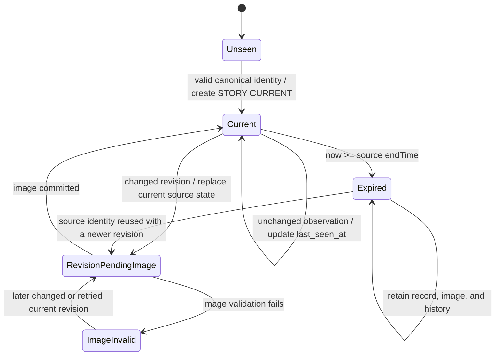
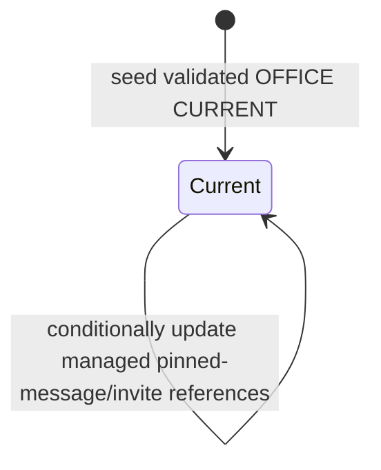
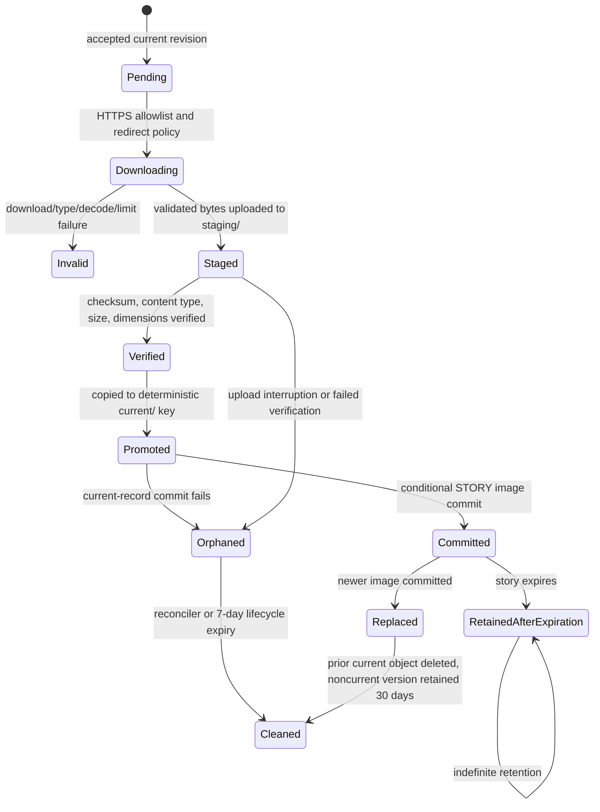
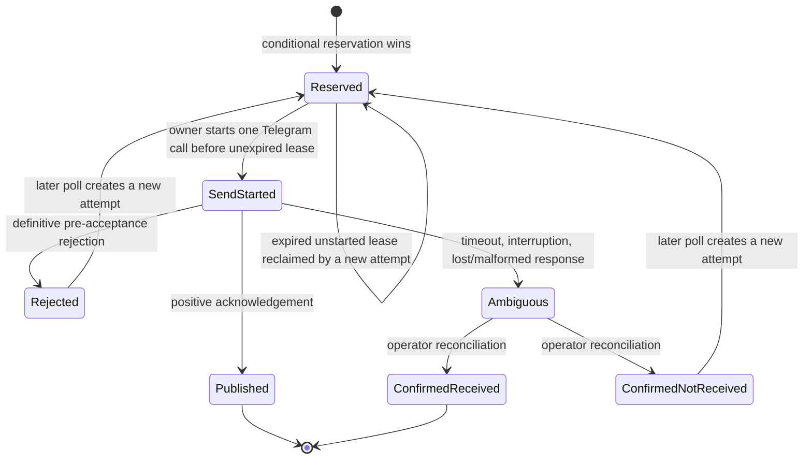
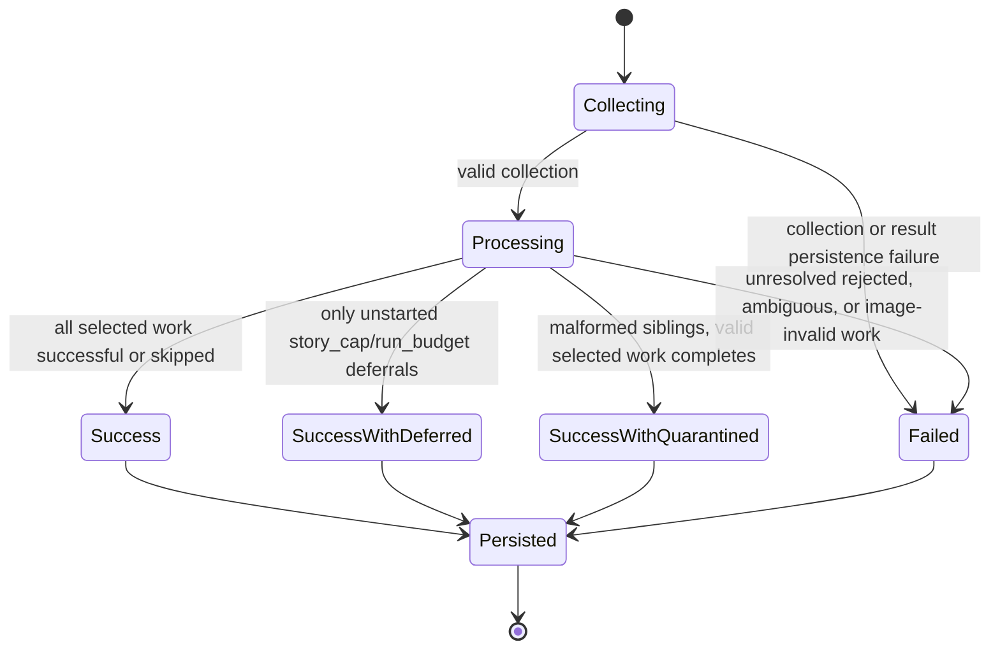
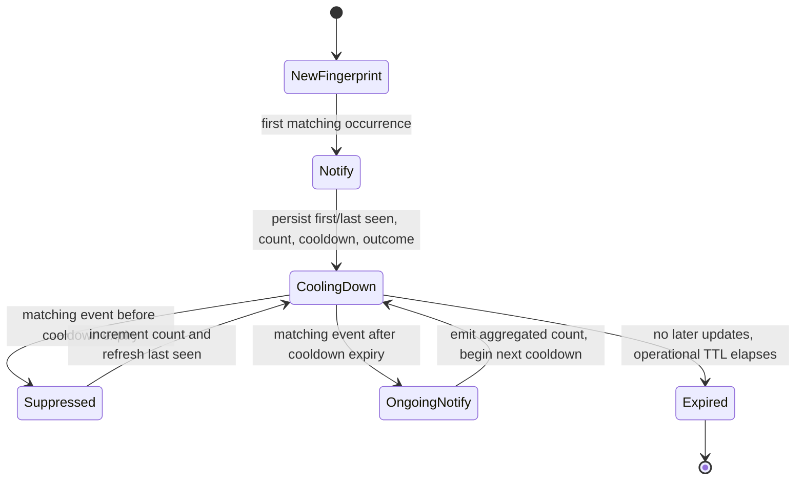

# Weather Story Bot state diagrams

This living reference diagrams the approved persistent lifecycles. **Implemented**
means the durable state primitive exists in the repository; **Planned** means the
transition or operational component remains in the active OpenSpec task set. It is a
contract reference, not a source of secrets or production identifiers.

## Story and revision lifecycle

**Implemented:** canonical current-story persistence, conditional revision replacement,
and expiration marking. **Planned:** scheduler-driven selection and Telegram work.

Expiration is a state change, not deletion or unpublication. An omitted story remains
current until its source `endTime`; failed retrieval also does not alter current state.
Superseded source content and images are not archived.

## Office operational-state lifecycle

**Implemented:** conditionally mutable current-office persistence. **Planned:** the
on-demand office-info manager (3.6).

`OFFICE#{office_id}/CURRENT` is the sole retained office-metadata record. It has no
TTL and no immutable audit or snapshot family. Conditional updates prevent stale
enrichment or management operations from replacing newer current operational state.

## Image lifecycle

**Implemented:** bounded validation, staging upload, verification, promotion, commit,
replacement cleanup, and staging reconciliation. **Planned:** production bucket
policy/lifecycle provisioning (5.2).

Only `Committed` images may be published. No committed record points into `staging/`.

## Publication reservation lifecycle

**Implemented:** reservation, lease, attempt/transition persistence, and the legal
state-order guard. **Planned:** Telegram caller, stale-send detection, protected
reconciliation Lambda, and retry orchestration.

Legal transitions are exactly `reserved → send_started → published|rejected|ambiguous`
and `ambiguous → confirmed_received|confirmed_not_received`. Only an expired
**unstarted** `reserved` lease may be reclaimed. An expired `send_started` attempt
stays protected: it must become ambiguous and be reconciled, never automatically sent
again. Each reservation permits at most one Telegram API call; any retry is a new
attempt. `429` and explicit `5xx` retries are planned to use new reservations when
their bounded delay/run budget permits; unknown acceptance is never auto-retried.

## Run result lifecycle

**Implemented:** immutable `RUN` record structure and allowed status enum. **Planned:**
scheduled handler classification and metrics/alerts.

A valid empty collection is `success`, with `discovered=0` and
`required_work_completed=true`. A persisted failed result should still permit the
handler to return normally when persistence succeeded; the durable status drives
monitoring.

## Alert-fingerprint lifecycle

**Implemented:** conditional fingerprint state updates and 30-day rolling TTL.
**Planned:** versioned fingerprint construction, dispatcher, four-hour cooldown
policy, aggregation, and fallback delivery.

Only `critical` and `error` conditions notify; planned `warning` controlled-deferral
events remain metric-only. The fingerprint consists of schema version, severity,
workflow, office ID, normalized error class, and story identity only for
story-specific failures. Run and correlation IDs are context, not fingerprint inputs.

For field contracts and retention, see [data-model.md](data-model.md).
